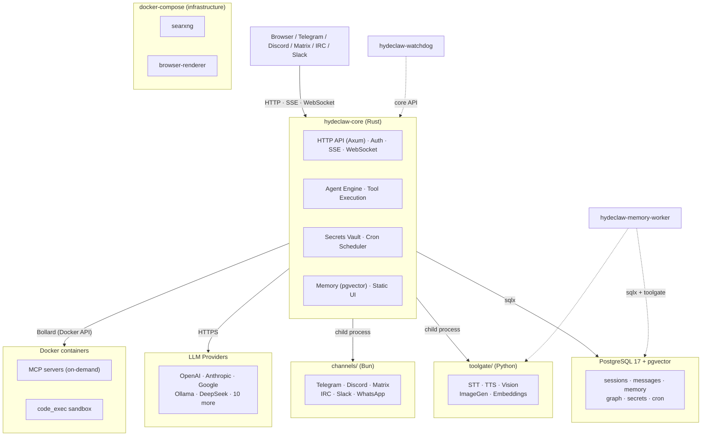

# HydeClaw

A self-hosted AI gateway for running personal AI agents. Single native Rust binary handles HTTP API, multi-agent orchestration, LLM calls, tool execution, channel bridging, memory, and encrypted secrets. Runs on any Linux server, VPS, or Raspberry Pi.

## Features

- **Multi-agent orchestration** — agents collaborate in shared sessions with @-mention routing, structured handoff, configurable turn limits, and cycle detection
- **Multi-channel** — Telegram, Discord, Matrix, IRC, Slack, WhatsApp adapters; agents opt in per channel
- **Tool execution** — YAML-defined HTTP tools (hot-reload, no restart), sandboxed code execution (Docker), MCP protocol support
- **Long-term memory** — PostgreSQL + pgvector hybrid search (semantic + FTS) with MMR reranking; two-tier: raw (time-decay) + pinned (permanent)
- **Skills system** — Markdown-based behavioral instructions loaded at runtime; per-agent and shared skills
- **Secrets vault** — ChaCha20Poly1305 encryption with per-agent scoping and env var fallback
- **PII protection** — automatic redaction of tokens, keys, passwords, and credentials in code execution output
- **Media processing** — STT (7 providers), TTS (6 providers), Vision (7 providers), Image Generation (5 providers) via pluggable registry
- **Cron scheduler** — agent-scoped scheduled tasks with timezone support and jitter
- **Web UI** — Next.js control panel: multi-agent chat with keyboard-navigable autocomplete, agent/provider/tool management, workspace canvas, memory explorer, audit log
- **Watchdog** — external health monitor with channel-based alerting
- **~26 MB binary, ~40 MB RAM idle** — lightweight enough for a Raspberry Pi, fast enough for any server

## Architecture



- **hydeclaw-core** — Rust binary: HTTP API, agent lifecycle, LLM calls, tool dispatch, memory, secrets, scheduler
- **hydeclaw-watchdog** — health monitor with channel-based alerting (separate binary)
- **hydeclaw-memory-worker** — background embedding and reindex tasks (separate binary)
- **channels** — TypeScript/Bun process managed by core: Telegram, Discord, Matrix, IRC, Slack, WhatsApp
- **toolgate** — Python/FastAPI process managed by core: STT, TTS, Vision, Image Generation, Embeddings
- **PostgreSQL 17 + pgvector** — sessions, messages, memory, graph, cron jobs, secrets

## Requirements

**From release** (installed automatically by `setup.sh`):

- Linux (Debian/Ubuntu/Fedora, ARM64 and x86_64) or macOS
- Docker (for PostgreSQL + optional services)
- Bun 1.x (for channel adapters)
- Python 3.11+ (for toolgate media hub)

**From source** (additionally):

- Rust 1.85+ (edition 2024)
- Node.js 22+ (for UI build)
- [cargo-zigbuild](https://github.com/rust-cross/cargo-zigbuild) (only for cross-compilation to ARM64)

## Quick Start

### From Release (recommended)

```bash
# Download and extract
tar xzf hydeclaw-v0.1.0.tar.gz
cd hydeclaw
./setup.sh
```

The setup script will:

- Install Docker, Bun, Python3 (if needed)
- Start PostgreSQL in Docker
- Generate `.env` with secure tokens
- Create and start systemd services

### From Source

```bash
git clone https://github.com/AronMav/hydeclaw.git
cd hydeclaw
./setup.sh
```

When no pre-built binaries are detected, `setup.sh` installs Rust and Node.js, then compiles from source.

### After Installation

Open the Web UI at `http://your-server:18789` to create agents, configure providers, and start chatting.

Or via API:

```bash
curl -X POST http://localhost:18789/api/agents \
  -H "Authorization: Bearer $HYDECLAW_AUTH_TOKEN" \
  -H "Content-Type: application/json" \
  -d '{"name": "assistant", "provider": "openai", "model": "gpt-4o-mini"}'
```

## Configuration

### Environment Variables (`.env`)

Only 3 variables belong in `.env`. Everything else goes into the secrets vault.

| Variable | Description |
| ---------- | ----------- |
| `HYDECLAW_AUTH_TOKEN` | HTTP API authentication token |
| `HYDECLAW_MASTER_KEY` | Vault encryption key (ChaCha20Poly1305) |
| `DATABASE_URL` | PostgreSQL connection string |

### Agent Config (`config/agents/{Name}.toml`)

```toml
[agent]
name = "Assistant"
language = "en"
provider = "openai"
model = "gpt-4o-mini"
temperature = 0.7
base = false

[agent.access]
mode = "restricted"
owner_id = "YOUR_TELEGRAM_USER_ID"

[agent.compaction]
enabled = true
threshold = 0.8

[agent.tool_loop]
max_iterations = 50
detect_loops = true
```

### Telegram Setup

1. Create a bot via [@BotFather](https://t.me/BotFather)
2. Add bot token via Web UI (Channels page) or API
3. The agent will start receiving messages immediately

## Tools

YAML files in `workspace/tools/`. Drop a file and it's available immediately — no restart.

```yaml
name: get_weather
description: "Get current weather for a location."
endpoint: "https://api.open-meteo.com/v1/forecast"
method: GET
parameters:
  latitude:
    type: number
    required: true
    location: query
  longitude:
    type: number
    required: true
    location: query
response_transform: "$.current"
```

Features: auth injection (Bearer, API key, header), response transforms (JSONPath), binary responses (photos, voice), SSRF protection.

## Skills

Markdown files in `workspace/skills/`. Behavioral instructions loaded at runtime:

```markdown
---
name: web_search
description: Strategy for searching the web
triggers:
  - search
  - find information
---

## Strategy
1. Use search_web for general queries
2. Use search_web_fresh for news and recent events
```

Per-agent skills go in `workspace/skills/{agent-name}/` — only that agent sees them.

## Supported LLM Providers

Any OpenAI-compatible API. 15 built-in providers:

- **OpenAI** — GPT-4o, GPT-4o-mini, o1, o3
- **Anthropic** — Claude (native API)
- **Google / Gemini** — Gemini (native API)
- **MiniMax** — M2.5, M2.7
- **DeepSeek** — DeepSeek-V3, DeepSeek-R1
- **Groq** — fast inference
- **Together** — open-source models
- **OpenRouter** — multi-provider gateway
- **Mistral** — Mistral, Codestral
- **xAI** — Grok
- **Perplexity** — search-augmented models
- **Ollama** — any local model
- **Claude CLI** — Claude Code as subprocess (Docker sandbox)
- **Gemini CLI** — Gemini CLI as subprocess (Docker sandbox)
- **Custom HTTP** — any OpenAI-compatible endpoint

Provider registry with active capability mapping (LLM, STT, TTS, Vision, ImageGen, Embedding). 138 API endpoints.

## Updating

```bash
~/hydeclaw/update.sh hydeclaw-v0.2.0.tar.gz
```

Preserves `.env`, `config/`, `workspace/`, and database.

## Uninstalling

```bash
~/hydeclaw/uninstall.sh
```

## Development

```bash
make check          # cargo check --all-targets
make test           # cargo test + UI tests
make lint           # cargo clippy
make build-arm64    # cross-compile for ARM64 (Raspberry Pi, AWS Graviton)
make deploy         # full deploy to remote server (binary + UI + migrations)
make doctor         # health check on remote server
make logs           # live logs from remote server
```

## Project Structure

```text
hydeclaw/
├── crates/
│   ├── hydeclaw-core/          # Main binary: API, agents, tools, memory
│   ├── hydeclaw-watchdog/      # Health monitor + alerting
│   ├── hydeclaw-memory-worker/ # Background embedding tasks
│   └── hydeclaw-types/         # Shared types
├── channels/                   # Channel adapters (TypeScript/Bun)
├── toolgate/                   # Media hub (Python/FastAPI)
├── ui/                         # Web UI (Next.js 16)
├── workspace/                  # Runtime workspace (tools, skills, agents)
├── config/                     # Configuration (TOML)
├── migrations/                 # PostgreSQL migrations (auto-applied)
├── docker/                     # Docker compose + Dockerfiles
├── setup.sh                    # Interactive installer
├── update.sh                   # One-command updater
├── uninstall.sh                # Complete uninstaller
└── release.sh                  # Build release archive
```

## Security

- **Authentication** — Bearer token on all API endpoints
- **Secrets vault** — ChaCha20Poly1305 encryption, per-agent scoping, env var fallback
- **PII redaction** — automatic filtering of tokens, keys, passwords in code_exec output
- **SSRF protection** — DNS-level private IP blocking for external YAML tools and web_fetch
- **Sandbox** — non-base agents execute code in Docker containers
- **Workspace isolation** — agents cannot write to other agents' directories
- **Tool approval** — configurable approval workflow for sensitive operations

## Documentation

- [API Reference](docs/API.md) — HTTP API, SSE events, WebSocket protocol
- [Architecture](docs/ARCHITECTURE.md) — internal design and data flow
- [Configuration Guide](docs/CONFIGURATION.md) — all config files and options
- [Security](SECURITY.md) — threat model and protections

## License

MIT — see [LICENSE](LICENSE).
