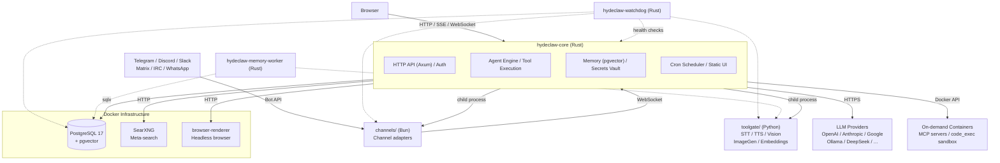

<div align="center">

# HydeClaw

**Self-hosted AI gateway for personal agents**

[](https://github.com/AronMav/hydeclaw/actions)
[](https://github.com/AronMav/hydeclaw/releases)
[](LICENSE)
[](https://www.rust-lang.org/)
[](https://github.com/AronMav/hydeclaw/releases)

</div>

HydeClaw is a self-hosted AI gateway for running personal AI agents. The Rust core orchestrates multi-agent workflows, LLM calls, tool execution, channel bridging, long-term memory, and encrypted secrets. Managed child processes handle chat channels (TypeScript/Bun) and media processing (Python/FastAPI). Infrastructure services run via Docker Compose.

<div align="center">

**28 LLM Providers** &bull; **6 Chat Channels** &bull; **3 Rust Binaries + 2 Managed Processes**

</div>

---

## Quick Start

### From Release (recommended)

Download the [latest release](https://github.com/AronMav/hydeclaw/releases), extract, and run the installer:

```bash
tar xzf hydeclaw-v0.1.0.tar.gz
cd hydeclaw
./setup.sh
```

The setup script will install dependencies (Docker, Bun, Python3), start PostgreSQL, generate `.env` with secure tokens, and create systemd services.

<details>
<summary><strong>From Source</strong></summary>

```bash
git clone https://github.com/AronMav/hydeclaw.git
cd hydeclaw
./setup.sh
```

When no pre-built binaries are found, `setup.sh` installs Rust and Node.js, then compiles from source.

</details>

### After Installation

Open the Web UI at `http://your-server:18789` to create agents, configure providers, and start chatting.

Or via API:

```bash
curl -X POST http://localhost:18789/api/agents \
  -H "Authorization: Bearer $HYDECLAW_AUTH_TOKEN" \
  -H "Content-Type: application/json" \
  -d '{"name": "assistant", "provider": "openai", "model": "gpt-4o-mini"}'
```

## Why HydeClaw?

- **Minimal deployment** -- three Rust binaries, two managed processes, one `setup.sh`. No Kubernetes, no microservice mesh. Deploy with `scp` + `systemctl restart`.
- **Privacy-first** -- runs entirely on your hardware. No data leaves your network unless you configure an external LLM provider.
- **No vendor lock-in** -- 15 built-in LLM providers + any OpenAI-compatible API. Switch providers by changing one line in a TOML file.
- **Production-ready** -- encrypted secrets vault, SSRF protection, PII redaction, sandboxed code execution, tool approval workflows.

## Features

- **Multi-agent orchestration** -- agents collaborate in shared sessions with @-mention routing, structured handoff, configurable turn limits, and cycle detection
- **Multi-channel** -- Telegram, Discord, Matrix, IRC, Slack, WhatsApp adapters; agents opt in per channel
- **Tool execution** -- YAML-defined HTTP tools (hot-reload, no restart), sandboxed code execution (Docker), MCP protocol support
- **Long-term memory** -- PostgreSQL + pgvector hybrid search (semantic + FTS) with MMR reranking; two-tier: raw (time-decay) + pinned (permanent)
- **Skills system** -- Markdown-based behavioral instructions loaded at runtime; per-agent and shared skills
- **Secrets vault** -- ChaCha20Poly1305 encryption with per-agent scoping and env var fallback
- **PII protection** -- automatic redaction of tokens, keys, passwords, and credentials in code execution output
- **Media processing** -- STT (7 providers), TTS (6 providers), Vision (7 providers), Image Generation (5 providers) via pluggable registry
- **Cron scheduler** -- agent-scoped scheduled tasks with timezone support and jitter
- **Web UI** -- Next.js dashboard: multi-agent chat, agent/provider/tool management, workspace canvas, memory explorer, audit log
- **Watchdog** -- external health monitor with channel-based alerting

## Supported LLM Providers

28 built-in providers. Any OpenAI-compatible API also works out of the box.

| Provider | Models |
|----------|--------|
| **OpenAI** | GPT-4o, GPT-4o-mini, o1, o3 |
| **Anthropic** | Claude (native API) |
| **Google** | Gemini (native API) |
| **DeepSeek** | DeepSeek-V3, DeepSeek-R1 |
| **Ollama** | Any local model |
| **Groq** | Fast inference |
| **Together** | Open-source models |
| **OpenRouter** | Multi-provider gateway |
| **Mistral** | Mistral, Codestral |
| **xAI** | Grok |
| **MiniMax** | M2.5, M2.7 |
| **Perplexity** | Search-augmented models |
| **Claude CLI** | Claude Code as subprocess |
| **Gemini CLI** | Gemini CLI as subprocess |
| **Hugging Face** | Inference API |
| **NVIDIA** | NIM models |
| **Qwen** | Alibaba DashScope |
| **GLM** | Zhipu AI |
| **Moonshot** | Kimi |
| **Venice AI** | Privacy-focused inference |
| **Cloudflare** | AI Gateway |
| **LiteLLM** | Local proxy |
| **Volcengine** | Doubao (ByteDance) |
| **Qianfan** | Baidu |
| **Xiaomi** | MiLM |
| **SGLang** | Local serving |
| **vLLM** | Local serving |
| **OpenAI Compatible** | Any custom endpoint |

Provider registry with active capability mapping (LLM, STT, TTS, Vision, ImageGen, Embedding).

## Architecture

HydeClaw is a polyglot system with a Rust core. In production it runs as **3 Rust binaries + 2 managed child processes + Docker infrastructure**.



<details>
<summary><strong>Component details</strong></summary>

| Component | Technology | Runtime | Role |
|-----------|-----------|---------|------|
| **hydeclaw-core** | Rust + Axum + Tokio | Systemd service | HTTP API, agent lifecycle, LLM calls, tool dispatch, memory, secrets, scheduler. Spawns and supervises channels and toolgate as child processes. |
| **hydeclaw-watchdog** | Rust (separate binary) | Systemd service | Health monitoring of core, postgres, channels, toolgate; channel-based alerting; auto-restart on failures. |
| **hydeclaw-memory-worker** | Rust (separate binary) | Systemd service | Background embedding reindex tasks via PostgreSQL task queue. |
| **channels/** | TypeScript / Bun | Managed child process | Telegram, Discord, Matrix, IRC, Slack, WhatsApp adapters. Started by core, communicates via internal WebSocket. |
| **toolgate/** | Python / FastAPI | Managed child process | STT, TTS, Vision, Image Generation, Embeddings. Started by core with uvicorn (single process, asyncio loop). |
| **ui/** | Next.js 16 + React 19 | Static build (nginx) | Web dashboard. Pre-built to static files, served by core's built-in static file handler. |
| **PostgreSQL** | 17 + pgvector | Docker container | Sessions, messages, memory, cron, secrets. |
| **SearXNG** | Latest | Docker container | Meta-search engine for web search tools. |
| **browser-renderer** | Headless browser | Docker container | Browser automation and page rendering. |
| **MCP servers** | Various | Docker (on-demand) | 14 MCP protocol servers, started by core via Docker API as needed. |
| **Sandbox** | Docker | Docker (on-demand) | Isolated code execution for non-base agents. |

</details>

<details>
<summary><strong>What runs in production</strong></summary>

**Systemd services (3 Rust binaries):**

| Service | Binary | Description |
|---------|--------|-------------|
| `hydeclaw-core` | `hydeclaw-core-{arch}` | Main gateway. Spawns channels and toolgate as child processes. |
| `hydeclaw-watchdog` | `hydeclaw-watchdog-{arch}` | Health monitor (optional, depends on core). |
| `hydeclaw-memory-worker` | `hydeclaw-memory-worker-{arch}` | Background tasks (optional, depends on core). |

**Managed child processes (started by core):**

| Process | Runtime | Port | Description |
|---------|---------|------|-------------|
| channels | Bun | 3100 | Chat channel adapters |
| toolgate | Python/uvicorn | 9011 | Media processing hub |

**Docker containers (always running):**

| Container | Port | Description |
|-----------|------|-------------|
| postgres | 5432 | PostgreSQL 17 + pgvector |
| searxng | 8080 | Meta-search engine |
| browser-renderer | 9020 | Headless browser |

**Docker containers (on-demand):**

14 MCP servers + sandbox containers for code execution -- started and stopped by core via the Docker API (Bollard).

</details>

## Configuration

### Environment Variables (`.env`)

Only 3 variables belong in `.env`. Everything else goes into the secrets vault.

| Variable | Description |
|----------|-------------|
| `HYDECLAW_AUTH_TOKEN` | HTTP API authentication token |
| `HYDECLAW_MASTER_KEY` | Vault encryption key (ChaCha20Poly1305) |
| `DATABASE_URL` | PostgreSQL connection string |

### Agent Config (`config/agents/{Name}.toml`)

```toml
[agent]
name = "Assistant"
language = "en"
provider = "openai"
model = "gpt-4o-mini"
temperature = 0.7

[agent.tool_loop]
max_iterations = 50
detect_loops = true
```

> [!TIP]
> Each agent is a separate TOML file. Changes are hot-reloaded -- no restart needed.

### Telegram Setup

1. Create a bot via [@BotFather](https://t.me/BotFather)
2. Add bot token via Web UI (Channels page) or API
3. The agent will start receiving messages immediately

## Tools

YAML files in `workspace/tools/`. Drop a file and it's available immediately -- no restart.

```yaml
name: get_weather
description: "Get current weather for a location."
endpoint: "https://api.open-meteo.com/v1/forecast"
method: GET
parameters:
  latitude:
    type: number
    required: true
    location: query
  longitude:
    type: number
    required: true
    location: query
response_transform: "$.current"
```

Supports: auth injection (Bearer, API key, header), response transforms (JSONPath), binary responses (photos, voice), SSRF protection, channel actions (send_photo, send_voice).

## Skills

Markdown files in `workspace/skills/`. Behavioral instructions loaded at runtime:

```markdown
---
name: web_search
description: Strategy for searching the web
triggers:
  - search
  - find information
---

## Strategy
1. Use search_web for general queries
2. Use search_web_fresh for news and recent events
```

Per-agent skills go in `workspace/skills/{agent-name}/` -- only that agent sees them.

## Updating

```bash
~/hydeclaw/update.sh hydeclaw-v0.2.0.tar.gz
```

Preserves `.env`, `config/`, `workspace/`, and database.

## Development

```bash
make check          # cargo check --all-targets
make test           # cargo test
make lint           # cargo clippy
make build-arm64    # cross-compile for ARM64 (Raspberry Pi, AWS Graviton)
make deploy         # full deploy to remote server (binary + UI + migrations)
make doctor         # health check on remote server
make logs           # live logs from remote server
```

<details>
<summary><strong>Project structure</strong></summary>

```text
hydeclaw/
├── crates/
│   ├── hydeclaw-core/          # Main binary: API, agents, tools, memory
│   ├── hydeclaw-watchdog/      # Health monitor + alerting
│   ├── hydeclaw-memory-worker/ # Background embedding tasks
│   └── hydeclaw-types/         # Shared types
├── channels/                   # Channel adapters (TypeScript/Bun)
├── toolgate/                   # Media hub (Python/FastAPI)
├── ui/                         # Web UI (Next.js 16)
├── workspace/                  # Runtime workspace (tools, skills, agents)
├── config/                     # Configuration (TOML)
├── migrations/                 # PostgreSQL migrations (auto-applied)
├── docker/                     # Docker compose + Dockerfiles
├── setup.sh                    # Interactive installer
├── update.sh                   # One-command updater
├── uninstall.sh                # Complete uninstaller
└── release.sh                  # Build release archive
```

</details>

<details>
<summary><strong>Requirements (from source)</strong></summary>

- Rust 1.85+ (edition 2024)
- Node.js 22+ (for UI build)
- Docker (for PostgreSQL + optional services)
- Bun 1.x (for channel adapters)
- Python 3 (for toolgate media hub)
- [cargo-zigbuild](https://github.com/rust-cross/cargo-zigbuild) (only for ARM64 cross-compilation)

</details>

## Security

- **Authentication** -- Bearer token on all API endpoints
- **Secrets vault** -- ChaCha20Poly1305 encryption, per-agent scoping, env var fallback
- **PII redaction** -- automatic filtering of tokens, keys, passwords in code_exec output
- **SSRF protection** -- DNS-level private IP blocking for YAML tools and web_fetch
- **Sandbox** -- non-base agents execute code in Docker containers
- **Workspace isolation** -- agents cannot write to other agents' directories
- **Tool approval** -- configurable approval workflow for sensitive operations

> [!IMPORTANT]
> The master key in `.env` is required for vault decryption. Back it up securely.

## Documentation

- [API Reference](docs/API.md) -- HTTP API, SSE events, WebSocket protocol
- [Architecture](docs/ARCHITECTURE.md) -- internal design and data flow
- [Configuration Guide](docs/CONFIGURATION.md) -- all config files and options
- [Security](SECURITY.md) -- threat model and protections

## License

MIT -- see [LICENSE](LICENSE).
